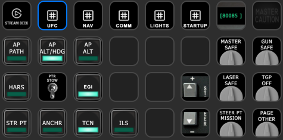
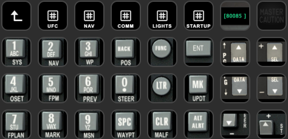
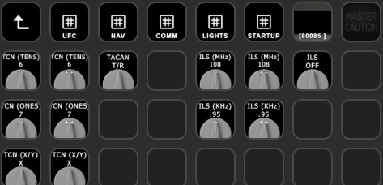
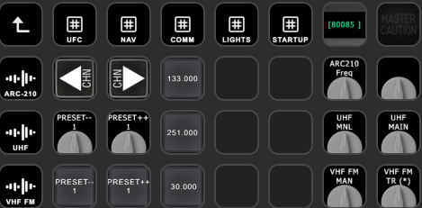
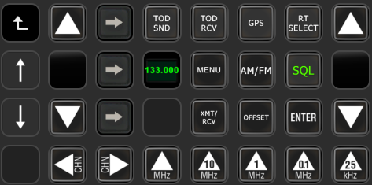
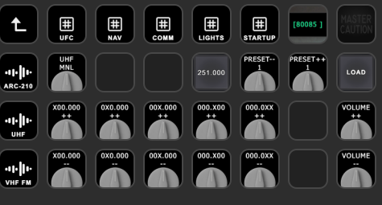
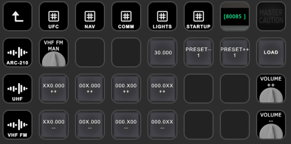
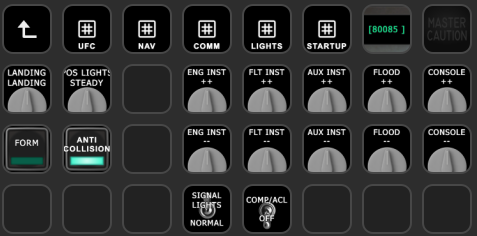
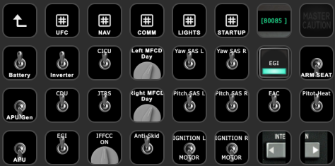

# Fred's StreamdeckXL Profile for the A-10C II

This profile is intended to be functional rather than one-to-one with the cockpit. It provides a main interface along with multiple task-oriented sections that are easy to navigate through.

## Credits

A few of the pages on this profile are not my own. They are taken from freeware profiles, but deserve mention.

* The marvelous UFC interface: Based off [this profile](https://www.digitalcombatsimulator.com/en/files/3321137/) which is some really marvelous work.
* The ARC-210 Radio Interface: This is straight up copied out of [this profile](https://www.digitalcombatsimulator.com/en/files/3330112/), which is great work, but I found it overwhelming and in need of better organization. I hope my profile does better.

## Idea

The basic idea is that the top row is consistent, and lets you hop directly to the various functional pages. The top left button will always bring you to the main screen (unless you're there, in which case it will exit the profile). The next 5 buttons are for the UFC, Navigation Functions (NAV), Communications functions (COMM), lights, and cold and dark startup.

## Requirements

* You will need [Asherao's Version of the DCS-ExportScripts](https://github.com/asherao/DCS-ExportScripts/tree/master) (or a version sufficiently similar.
* You will need the [Streamdeck DCS Interface from enertial](https://github.com/enertial/streamdeck-dcs-interface)

The latter has instructions how to get both of them set up and functional. 

After following those:
1. Import this profile into your streamdeck
2. Reassign the profile from the main screen in the upper right to be your default profile (or a link back to this one, if you use other methods to navigate between profiles)

## Screenshots

### Main Screen

The main screen consists of autopilot functions, main navigation functions, and weapon functions.

UFC screen should be self-explanatory.

The navigation screen has controls for TACAN and ILS tuning.

The comm screen provides quick access to presets for all 3 radios, as well as the basic configuration functions for those radios. On the left hand side, there are buttons to more extensive controls for each of the 3 radios.

The ARC-210 radio controls. Unlike every other page, this does not have links to each of the functional areas. The top left button will bring you back to the COMM page.

UHF radio tuning, volume, and preset controls.

VHF FM radio tuning, volume, and preset controls.

Provides controls over interior and exterior lights.

Provides access to the controls needed to do a cold start. It does require that you're able to "kick" the throttle to start it using one of your HOTAS commands, but everything else can be done in a generally left-to-right sequence.
